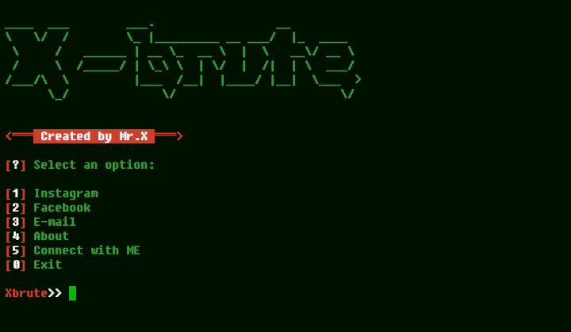

# X-brute


## introduction
This is a bruteforce tool for hacking social media quickly and efficiently 

## Instalations
```
$ apt upgrade
$ apt install git -y
$ git clone https://github.com/Whomrx666/X-brute
$ cd X-brute
$ chmod +x *
$ bash setup.sh or ./setup.sh
$ python X-brute.py or python3 X-brute.py
```
## Instructions
- **First**: Choose the number that is synonymous with the account to be hacked
- **Second**: Enter the user to be hacked and then enter
- **Third**: Choose a password recording method and then enter
- **Fourth**: If you have a code file, press the number 2.If you don't have a code file, press 1 
- **Last**: The correct symbol will appear in green

## Observation
This is a tool for education only, I am not responsible for any misuse
### Original Author
<a href="https://github.com/Whomrx666"></a>

## CONNECT WITH ME :

[](https://whomrxhackers.blogspot.com/)
[](https://twitter.com/whomrx666)
[](https://youtube.com/@whomrx666)
[](https://facebook.com/https://www.facebook.com/whomrx.666)
[](https://t.me/@Whomr_X)
[](https://wa.me/6285933663749)
[](https://www.tiktok.com/@whomr.x)

**If you want to donate, click on the button**
<a href="https://saweria.co/whomrx"></a>

### Visitors :

